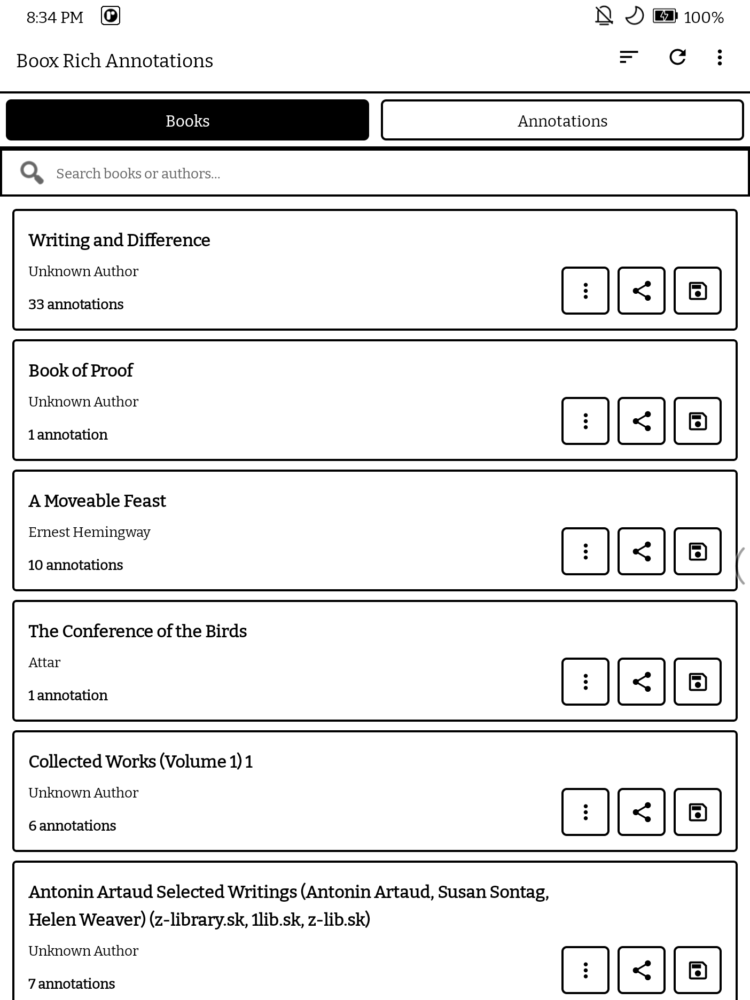
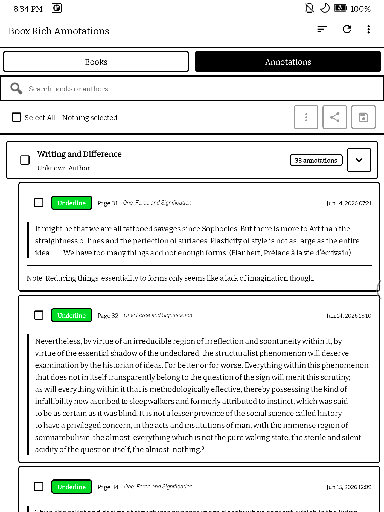
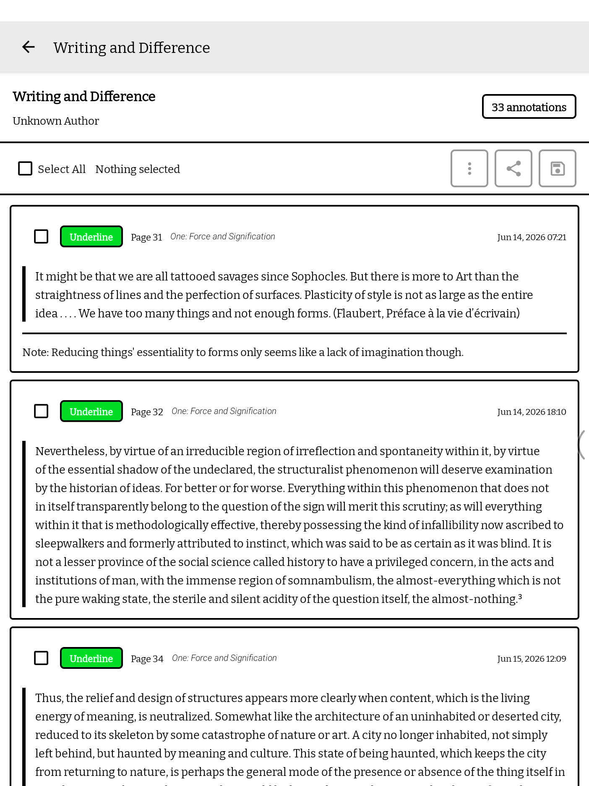
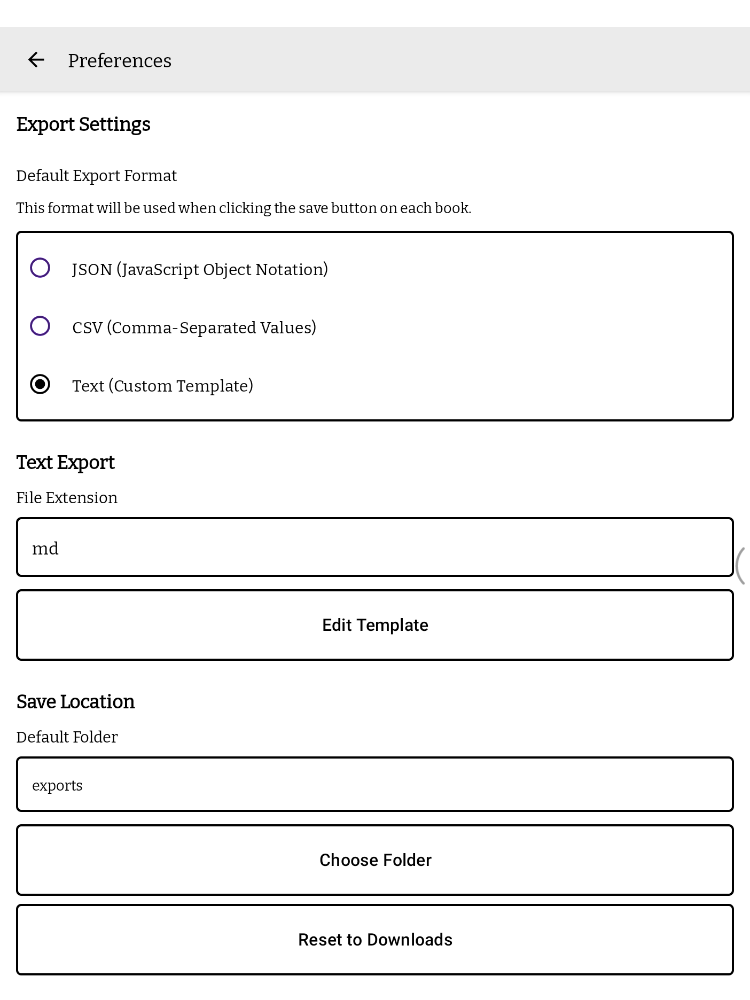
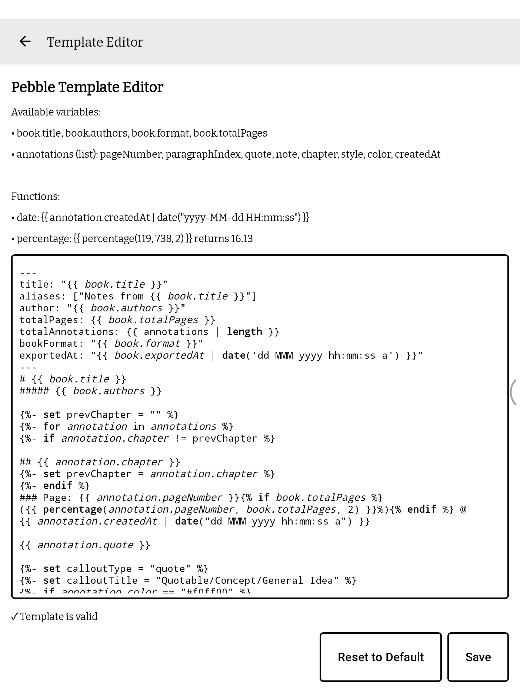

# Boox → Notion Highlight Sync

This is a fork of [Boox Rich Annotations](https://github.com/uroybd/BooxRichAnnotations) (MIT) that adds **automatic, free syncing of NeoReader highlights to a Notion database**: a Readwise-style flow without a paid service.

It reads highlights directly from NeoReader's on-device database (no manual export, no root) and, about once an hour when the device is online, appends any new highlights to one Notion page per book.

## Contents

- [How it works](#how-it-works)
- [Requirements](#requirements)
- [Setup](#setup)
- [What appears in Notion](#what-appears-in-notion)
- [Limitations](#limitations)
- [Battery and resource use](#battery-and-resource-use)
- [Troubleshooting](#troubleshooting)
- [Building the APK](#building-the-apk)

## How it works

1. A background job (Android WorkManager) runs roughly every hour, only when the device has a network connection.
2. It reads all NeoReader books and highlights from the Onyx content provider on the device.
3. It compares them against a local list of highlights it has already sent. Anything new is grouped by book.
4. For each book with new highlights, it finds the page in your Notion database whose **Name** exactly matches the book title, or creates a new page if none exists.
5. It appends the new highlights to the end of that page and updates the book's **Highlights**, **Last Highlighted** and **Last Synced** properties.

Books with nothing new are skipped entirely: no Notion requests are made, so their pages and **Last Edited** times are untouched.

## Requirements

- An Onyx Boox device with the built-in NeoReader app (developed on a Go Color 7 Gen 2; the base app was tested on a Tab Mini C)
- Android 7.0 or later
- A Notion account (the free plan works)
- A Notion database with these properties, named exactly as shown:

  | Property | Type |
  | --- | --- |
  | `Name` | Title |
  | `Author` | Text |
  | `Highlights` | Number |
  | `Last Highlighted` | Date |
  | `Last Synced` | Date |

  Other properties (relations, created time, etc.) are fine and are left alone.

## Setup

### 1. Create a Notion integration

1. Go to [notion.so/profile/integrations](https://www.notion.so/profile/integrations) and create a new **internal** integration in your workspace.
2. Give it a name such as `Boox Sync`. It needs the **Read content**, **Update content** and **Insert content** capabilities (the defaults).
3. Copy the **Internal Integration Secret** (starts with `ntn_` or `secret_`). Treat it like a password.

### 2. Give the integration access to your database

1. Open your book database in Notion.
2. Click **•••** (top right) → **Connections** → find your integration and add it.

Without this step the app gets a "Could not find database" error.

### 3. Install the app on the Boox

1. Download `boox-notion-sync.apk` from the [`apk` branch](https://github.com/s-ishrak/boox-notion-sync/tree/apk) of this repository (or from the latest run under **Actions → Build APK → Artifacts**).
2. Copy it to the Boox (BOOXDrop, USB, or email) and open it.
3. Allow installing apps from unknown sources when prompted.

The app appears on the Boox as **Boox Rich Annotation**.

### 4. Connect the app to Notion

1. Open the app and tap the **⋮** menu → **Notion Sync**.
2. Paste the integration secret into **Token**.
3. Paste the database link (or its 32-character ID) into **Database**. To get the link, open the database as a full page in Notion and copy its URL.
4. Tap **Save**, then **Sync now**.

The status line shows the result, for example `Last sync 4 Oct, 14:45: 12 new highlight(s) in 3 book(s)`. From then on the hourly sync runs automatically.

### 5. Keep it running in the background

Boox devices freeze background apps aggressively, which stops the hourly sync. In the Boox system settings, open the app management / **App Freeze** settings and exclude **Boox Rich Annotation** from freezing. Menu names vary by firmware version.

## What appears in Notion

Each new highlight is appended to its book's page as:

- a **quote block** with the highlighted text,
- a paragraph starting with **Note:** if you wrote a note on the highlight,
- a grey italic line with the page, chapter and date, e.g. *p. 42 · Chapter Six · 4 Oct 2026*.

Book page properties:

| Property | Set to |
| --- | --- |
| `Name`, `Author` | Book title and author from NeoReader (only when the app creates the page) |
| `Highlights` | Previous value plus the number of new highlights |
| `Last Highlighted` | When the newest synced highlight was made on the Boox |
| `Last Synced` | When new highlights were last added to this book (not the last time the app ran) |

## Limitations

- **One-way, new highlights only.** Editing or deleting a highlight on the Boox does not change Notion, and editing in Notion does not affect the Boox.
- **The first sync sends everything** already highlighted in NeoReader.
- **Books are matched by exact title.** If a book already exists in your database under the same title (for example from a Kindle import), highlights go onto that page. A slightly different title creates a new page.
- **Reinstalling or clearing the app's data** resets its record of what was sent, so all highlights are sent again (duplicates).
- **NeoReader's data access is undocumented.** A Boox firmware update could change it and break syncing.
- Only highlights made in **NeoReader** are synced, not other reading apps.

## Battery and resource use

Light. Nothing runs between syncs. Each run reads the local highlight list (a fraction of a second) and contacts Notion only for books with new highlights; a run with nothing new makes no network requests. The record of sent highlights is about a hundred bytes per highlight.

## Troubleshooting

The **Notion Sync** screen shows the last result, including errors.

| Message | Fix |
| --- | --- |
| `API token is invalid` (401) | Re-copy the integration secret into **Token** and tap **Save**. |
| `Could not find database` (404) | Connect the integration to the database (Setup step 2), and check the database link. |
| `... is not a property that exists` / validation error (400) | A required property is missing or named differently. See [Requirements](#requirements). |
| `Last sync failed (network)` | The device was offline; the next hourly run retries. |
| Status never changes | The app is probably frozen. See Setup step 5, then tap **Sync now** once. |
| `0 new highlight(s)` but you just highlighted | Make sure the highlight was made in NeoReader, then tap **Sync now**. |

## Building the APK

Every push to `main` builds the APK with GitHub Actions (`.github/workflows/build.yml`):

- the APKs are attached to the run as the `boox-notion-sync-apk` artifact, and
- the universal APK is published to the `apk` branch as `boox-notion-sync.apk`.

To build locally instead (JDK 21 and the Android SDK required):

```bash
./gradlew assembleFdroidDebug
# APK: app/build/outputs/apk/fdroid/debug/app-fdroid-universal-debug.apk
```

The sync code lives in `NotionSync.kt` (sync logic), `NotionClient.kt` (Notion API), `SyncWorker.kt` (hourly job) and `NotionSettingsActivity.kt` (settings screen).

---

*The original Boox Rich Annotations documentation follows.*

# Boox Rich Annotation

A native Android app for extracting and exporting rich annotations from Onyx Boox e-readers.

## Screenshots

<p align="center">
  
  
  
  
  
</p>

## Features

- 📚 **Browse Your Library** - View all your ebooks (EPUB, MOBI, AZW/AZW3) in one place
- 🔍 **Search** - Find books instantly by title or author
- 🗂️ **Books & Annotations Tabs** - Browse by book, or see every annotation from every book grouped under collapsible book headers in one scrollable list
- 📖 **Book Detail View** - Tap into a book to see each annotation as its own card (style, page, chapter, timestamp, quote, note)
- ✅ **Bulk Selection & Export** - Select individual annotations, a whole book at once, or everything across multiple books, then share/save just that selection
- 🎨 **Rich Annotations** - Exports annotations with colors, styles, and notes
- 📥 **Multiple Export Formats** - JSON, CSV, or customizable text (Markdown, etc.), including multi-book exports
- ✏️ **Template Editor** - Create custom export templates with Pebble templating engine
- 🎨 **Syntax Highlighting** - Bold keywords, italic variables in template editor for better readability
- 📁 **Custom Save Location** - Choose any folder on your device to save exported files
- ⚙️ **Preferences** - Configure default export format and text templates
- 🔄 **Real-time Refresh** - Fetch latest data on demand
- 🗑️ **Deleted Book Detection** - Flags books whose underlying file is gone but whose annotations still linger in Onyx's database, with a filter to show/hide them
- ⚡ **E-ink Optimized** - Pure black & white theme with zero animations for optimal e-ink display
- 🎯 **No Duplicates** - Automatically deduplicates edited annotations

## Export Formats

### JSON
```json
{
  "title": "Book Title",
  "authors": "Author Name",
  "format": "epub",
  "path": "/storage/emulated/0/Books/book-title.epub",
  "totalPages": 300,
  "publisher": "Publisher Name",
  "language": "English",
  "isbn": "978-0-123456-78-9",
  "description": "Book description",
  "exportedAt": 1718465887527,
  "annotations": [
    {
      "quote": "Selected text...",
      "pageNumber": 42,
      "chapter": "Chapter Name",
      "createdAt": 1781261518476,
      "color": "#a020f0",
      "style": "highlight",
      "note": "Optional note text"
    }
  ]
}
```

### CSV
Simple spreadsheet format with columns:
- Book, Author, Page, Quote, Chapter, Style, Color, Note, Created At, Path

`Path` is the book's on-device file location, useful as a stable per-book identifier for joining/filtering rows across multiple exports in a spreadsheet or query tool.

### Text (Customizable)
Export to Markdown or any text format using Pebble templates. The default template includes:
- Title and author header
- Annotations grouped by chapter
- Page numbers with timestamps
- Color and style information
- Metadata table with export timestamp

**Available template variables:**
- `book.title`, `book.authors`, `book.format`, `book.path`, `book.totalPages`, `book.publisher`, `book.language`, `book.isbn`, `book.description`, `book.exportedAt`
- `annotations` (list): `pageNumber`, `quote`, `note`, `chapter`, `style`, `color`, `createdAt`

**Available template functions:**
- `date` filter: `{{ timestamp | date("yyyy-MM-dd HH:mm:ss") }}`
- `percentage`: `{{ percentage(annotation.pageNumber, book.totalPages, 2) }}` - calculates percentage with precise decimal formatting

### Multi-Book Export
From the **Annotations** tab, select annotations across several books at once and export or share them together in any format (JSON, CSV, or Text).

## Installation

### Requirements
- Android 7.0 (API 24) or higher
- Onyx Boox device with NeoReader app installed

### Install from APK
1. Download the latest APK from the [Releases](../../releases) page
2. Enable "Install from Unknown Sources" in your device settings
3. Install the APK
4. Open the app and grant necessary permissions

### Build from Source
```bash
git clone https://github.com/uroybd/BooxRichAnnotations.git
cd BooxRichAnnotations
./gradlew assembleStandardDebug
```

The APK will be available at: `app/build/outputs/apk/standard/debug/app-standard-debug.apk`

## Permissions

- **QUERY_ALL_PACKAGES** - Required on Android 11+ to access Onyx content provider
- **WRITE_EXTERNAL_STORAGE** - Only on Android 9 and below for file downloads

## Compatibility

Tested on:
- Onyx Boox Tab Mini C (Android 11)
- Other Onyx Boox devices should work if they use the NeoReader app

## Known Limitations

- Only works on Onyx Boox devices (uses proprietary content provider)
- Requires the official Onyx NeoReader app to be installed
- Cannot modify or delete annotations (read-only access)

## License

MIT License - see [LICENSE](LICENSE) file for details

## Contributing

Contributions are welcome! Please feel free to submit a Pull Request.

## Support

If you encounter any issues or have suggestions, please open an issue on GitHub.

