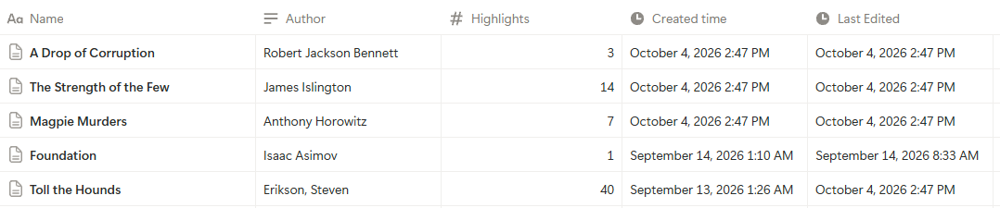
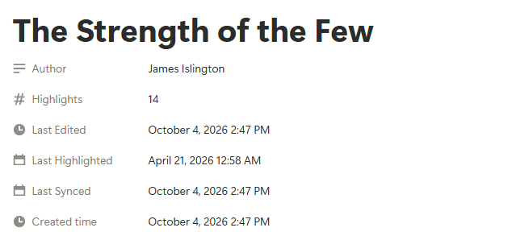
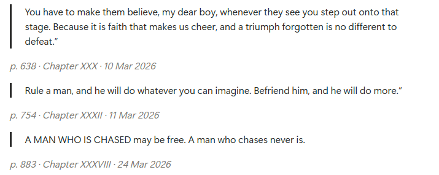

# Boox → Notion Highlight Sync

**Automatically sync your NeoReader highlights from an Onyx Boox to Notion: free, no Readwise subscription, no manual exports.**

Highlight in NeoReader as usual. About once an hour, when your Boox is online, new highlights are added to a page for that book in your own Notion database.

<p align="center">
  
</p>

This is an extended version of [Boox Rich Annotations](https://github.com/uroybd/BooxRichAnnotations) by [@uroybd](https://github.com/uroybd) (MIT licensed), which does the hard part of reading NeoReader's annotations on the device. This project adds the Notion sync on top. All of the original app's export features still work.

## Contents

- [Features](#features)
- [Screenshots](#screenshots)
- [Requirements](#requirements)
- [Setup (about 10 minutes)](#setup-about-10-minutes)
- [What appears in Notion](#what-appears-in-notion)
- [How it works](#how-it-works)
- [Limitations](#limitations)
- [Privacy](#privacy)
- [Battery and resource use](#battery-and-resource-use)
- [Troubleshooting](#troubleshooting)
- [FAQ](#faq)
- [Building from source](#building-from-source)
- [Credits and license](#credits-and-license)

## Features

- **Automatic:** syncs in the background about once an hour, whenever the Boox is online.
- **No exports, no root:** reads highlights straight from NeoReader's on-device database.
- **One Notion page per book:** new highlights are appended to the book's page; existing pages are matched by title.
- **Notes and context included:** each highlight keeps your note, page number, chapter and date.
- **Works with an existing database:** e.g. one you already use for Kindle highlights, as long as it has the [required properties](#requirements).
- **Free and private:** talks only to Notion's official API using your own integration token; no third-party server.
- **E-ink friendly:** black-and-white UI with large touch targets.

## Screenshots

| A book page in Notion | Highlights on the page |
| --- | --- |
|  |  |

| The app on a Boox (book view) |
| --- |
|  |

## Requirements

- An **Onyx Boox** e-reader with the built-in **NeoReader** app, running Android 7.0 or later. Developed on a Go Color 7 Gen 2; the original app was tested on a Tab Mini C. Other Boox models with NeoReader should work.
- A **Notion** account. The free plan is fine.
- A **Notion database** with these properties, named exactly as shown (capitalisation matters):

  | Property | Type | Filled in by the app |
  | --- | --- | --- |
  | `Name` | Title | Book title (for new pages) |
  | `Author` | Text | Author (for new pages) |
  | `Highlights` | Number | Running count of highlights |
  | `Last Highlighted` | Date | When the newest synced highlight was made |
  | `Last Synced` | Date | When new highlights were last added |

  Extra properties (tags, ratings, relations, etc.) are fine. The app leaves them alone.

## Setup (about 10 minutes)

### 1. Create the Notion database

Skip this if you already have a database with the properties above.

1. In Notion, create a new page and choose **Table** (a full-page database). Name it something like `Book Highlights`.
2. The table already has a `Name` column. Add the other four columns from the table above: click **+** at the right of the header row, pick the type, and type the exact name.
3. You can delete the default `Tags` column if Notion added one.

### 2. Create a Notion integration (your sync token)

1. Go to **[notion.so/profile/integrations](https://www.notion.so/profile/integrations)** and click **New integration**.
2. Give it a name (e.g. `Boox Sync`), pick your workspace, and keep the type as **Internal**.
3. Make sure it has **Read content**, **Update content** and **Insert content** capabilities (the defaults).
4. Save, then copy the **Internal Integration Secret** (it starts with `ntn_` or `secret_`). Keep it private; anyone with it can edit the pages you share with the integration.

### 3. Connect the integration to your database

1. Open your database as a full page in Notion.
2. Click **•••** in the top-right corner → **Connections** → search for your integration and add it.

The integration can only see pages you connect it to. If you skip this, syncing fails with "Could not find database".

### 4. Install the app on your Boox

1. Download the latest **`boox-notion-sync.apk`** from the **[Releases page](https://github.com/s-ishrak/boox-notion-sync/releases/latest)**. You can download it directly on the Boox in its browser, or on a computer and transfer it with BOOXDrop, USB, or email.
2. Open the APK on the Boox and allow installing from unknown sources when prompted.

The app shows up as **Boox Rich Annotation**. It installs alongside the original app if you already have it.

### 5. Connect the app to Notion

1. Open the app and tap the **⋮** menu (top right) → **Notion Sync**.
2. **Token:** paste the integration secret from step 2.
3. **Database:** paste the database's link. In Notion, open the database as a full page, click **Share** → **Copy link** (or copy the URL from the browser). The 32-character database ID on its own also works.
4. Tap **Save**, then **Sync now**.

After a moment the status line shows something like `Last sync 4 Oct, 14:45: 12 new highlight(s) in 3 book(s)`. Check Notion and your books should be there. From now on it syncs by itself.

### 6. Stop the Boox from freezing the app (important)

Boox firmware freezes background apps to save battery, which stops the hourly sync. Exclude the app from this:

- Open the Boox **Settings** → **Apps** (or **App Management**) → **App Freeze**, and turn freezing **off** for **Boox Rich Annotation**.
- Menu names differ between firmware versions. On some models it's in the app's long-press menu on the home screen under **Freeze** or **Optimization**.

If syncing seems to stop after a while, this is almost always the reason.

## What appears in Notion

Each new highlight is appended to the end of its book's page as:

1. a **quote block** with the highlighted text,
2. a **Note:** paragraph, if you wrote a note on that highlight,
3. a small grey line with the page, chapter and date, e.g. *p. 42 · Chapter Six · 4 Oct 2026*.

The book's `Highlights`, `Last Highlighted` and `Last Synced` properties are updated at the same time. Books with no new highlights aren't touched at all, so their **Last Edited** time in Notion stays the same.

## How it works

1. Android's WorkManager wakes the app roughly every hour, only when there's a network connection.
2. The app reads all books and highlights from NeoReader's content provider on the device.
3. It compares them with a local list of highlights it has already sent, so only new highlights go further.
4. For each book with new highlights, it looks for a page in your database whose `Name` exactly matches the book title, or creates one.
5. It appends the highlights and updates the book's properties through the official Notion API.

## Limitations

- **One-way, new highlights only.** Editing or deleting a highlight on the Boox doesn't change Notion, and changes in Notion don't reach the Boox.
- **The first sync sends every existing highlight** in NeoReader.
- **Books are matched by exact title.** If your database already has a page with the same title (e.g. from a Kindle import), highlights are added to it. A slightly different title creates a new page; rename one to match and future highlights go to the right place.
- **Reinstalling the app or clearing its data** resets its memory of what was sent, so everything is sent again (duplicates).
- **Only NeoReader highlights** are synced, not those made in KOReader, Kindle or other apps.
- **NeoReader's data access isn't officially documented.** A Boox firmware update could change it and break syncing; please open an issue if that happens.
- Highlights sync roughly hourly, not instantly. Use **Sync now** when you want them straight away.

## Privacy

- The app talks only to `api.notion.com`, using your own integration token. There is no server in between, no analytics, and no account.
- The token and database ID are stored in the app's private storage on your Boox.
- The integration only has access to the pages you connect it to in Notion.

## Battery and resource use

Light. Nothing runs between syncs. Each hourly run reads the local highlight list (a fraction of a second) and contacts Notion only for books with new highlights; a run with nothing new makes no network requests. The app is about 7 MB, and its record of sent highlights is roughly a hundred bytes per highlight.

## Troubleshooting

Open **⋮ → Notion Sync** in the app; the status line shows the last result, including errors.

| Message | What to do |
| --- | --- |
| `API token is invalid` (401) | Copy the integration secret again (step 2), paste it into **Token**, tap **Save**. |
| `Could not find database` (404) | Connect the integration to the database (step 3) and check the database link. |
| `... is not a property that exists` or another 400 error | A required property is missing, misspelled, or the wrong type. Compare with [Requirements](#requirements). |
| `Last sync failed (network)` | The Boox was offline. The next hourly run retries automatically. |
| The status never changes | The app is being frozen. See step 6, then tap **Sync now** once. |
| `0 new highlight(s)` right after highlighting | Make sure you highlighted in NeoReader (not another reader app), then tap **Sync now**. |
| Highlights went to a new page instead of my existing one | The titles differ. Rename one to match exactly. |

## FAQ

**Does it work on Boox models other than the Go Color 7?**
It should work on any Boox that uses NeoReader. Reports for other models are welcome in [Issues](https://github.com/s-ishrak/boox-notion-sync/issues).

**Can I use my existing Kindle highlights database?**
Yes, if it has the five required properties. Books with the same title share a page.

**Does it sync PDF annotations or handwritten notes?**
It has been tested with EPUB books. PDF text highlights may work if NeoReader stores them the same way; reports are welcome. Handwritten scribbles aren't text, so they're not synced.

**Will it sync highlights I made before installing?**
Yes. The first sync sends everything already in NeoReader.

**Can I change how often it syncs?**
Not from the app yet; it's set to about once an hour. **Sync now** runs it immediately.

## Building from source

Every push to `main` builds the APK with GitHub Actions (`.github/workflows/build.yml`). To build locally (JDK 21 and the Android SDK required):

```bash
git clone https://github.com/s-ishrak/boox-notion-sync.git
cd boox-notion-sync
./gradlew assembleFdroidDebug
# APK: app/build/outputs/apk/fdroid/debug/app-fdroid-universal-debug.apk
```

The sync code is in `app/src/main/java/me/utsob/booxrichannotation/`:

- `NotionSync.kt`: sync logic (which highlights are new, matching books to pages)
- `NotionClient.kt`: Notion API calls
- `SyncWorker.kt`: the hourly background job
- `NotionSettingsActivity.kt`: the Notion Sync settings screen

Issues and pull requests are welcome.

## Credits and license

- Built on **[Boox Rich Annotations](https://github.com/uroybd/BooxRichAnnotations)** by [@uroybd](https://github.com/uroybd), which provides the NeoReader annotation reading and export features.
- Released under the [MIT License](LICENSE), the same as the original project.
- Not affiliated with Onyx Boox or Notion.

---

## Original Boox Rich Annotations documentation

*The original project's README follows. The export features described there are all still available in this app.*


# Boox Rich Annotation

A native Android app for extracting and exporting rich annotations from Onyx Boox e-readers.

## Screenshots

<p align="center">
  
  
  
  
  
</p>

## Features

- 📚 **Browse Your Library** - View all your ebooks (EPUB, MOBI, AZW/AZW3) in one place
- 🔍 **Search** - Find books instantly by title or author
- 🗂️ **Books & Annotations Tabs** - Browse by book, or see every annotation from every book grouped under collapsible book headers in one scrollable list
- 📖 **Book Detail View** - Tap into a book to see each annotation as its own card (style, page, chapter, timestamp, quote, note)
- ✅ **Bulk Selection & Export** - Select individual annotations, a whole book at once, or everything across multiple books, then share/save just that selection
- 🎨 **Rich Annotations** - Exports annotations with colors, styles, and notes
- 📥 **Multiple Export Formats** - JSON, CSV, or customizable text (Markdown, etc.), including multi-book exports
- ✏️ **Template Editor** - Create custom export templates with Pebble templating engine
- 🎨 **Syntax Highlighting** - Bold keywords, italic variables in template editor for better readability
- 📁 **Custom Save Location** - Choose any folder on your device to save exported files
- ⚙️ **Preferences** - Configure default export format and text templates
- 🔄 **Real-time Refresh** - Fetch latest data on demand
- 🗑️ **Deleted Book Detection** - Flags books whose underlying file is gone but whose annotations still linger in Onyx's database, with a filter to show/hide them
- ⚡ **E-ink Optimized** - Pure black & white theme with zero animations for optimal e-ink display
- 🎯 **No Duplicates** - Automatically deduplicates edited annotations

## Export Formats

### JSON
```json
{
  "title": "Book Title",
  "authors": "Author Name",
  "format": "epub",
  "path": "/storage/emulated/0/Books/book-title.epub",
  "totalPages": 300,
  "publisher": "Publisher Name",
  "language": "English",
  "isbn": "978-0-123456-78-9",
  "description": "Book description",
  "exportedAt": 1718465887527,
  "annotations": [
    {
      "quote": "Selected text...",
      "pageNumber": 42,
      "chapter": "Chapter Name",
      "createdAt": 1781261518476,
      "color": "#a020f0",
      "style": "highlight",
      "note": "Optional note text"
    }
  ]
}
```

### CSV
Simple spreadsheet format with columns:
- Book, Author, Page, Quote, Chapter, Style, Color, Note, Created At, Path

`Path` is the book's on-device file location, useful as a stable per-book identifier for joining/filtering rows across multiple exports in a spreadsheet or query tool.

### Text (Customizable)
Export to Markdown or any text format using Pebble templates. The default template includes:
- Title and author header
- Annotations grouped by chapter
- Page numbers with timestamps
- Color and style information
- Metadata table with export timestamp

**Available template variables:**
- `book.title`, `book.authors`, `book.format`, `book.path`, `book.totalPages`, `book.publisher`, `book.language`, `book.isbn`, `book.description`, `book.exportedAt`
- `annotations` (list): `pageNumber`, `quote`, `note`, `chapter`, `style`, `color`, `createdAt`

**Available template functions:**
- `date` filter: `{{ timestamp | date("yyyy-MM-dd HH:mm:ss") }}`
- `percentage`: `{{ percentage(annotation.pageNumber, book.totalPages, 2) }}` - calculates percentage with precise decimal formatting

### Multi-Book Export
From the **Annotations** tab, select annotations across several books at once and export or share them together in any format (JSON, CSV, or Text).

## Installation

### Requirements
- Android 7.0 (API 24) or higher
- Onyx Boox device with NeoReader app installed

### Install from APK
1. Download the latest APK from the [Releases](../../releases) page
2. Enable "Install from Unknown Sources" in your device settings
3. Install the APK
4. Open the app and grant necessary permissions

### Build from Source
```bash
git clone https://github.com/uroybd/BooxRichAnnotations.git
cd BooxRichAnnotations
./gradlew assembleStandardDebug
```

The APK will be available at: `app/build/outputs/apk/standard/debug/app-standard-debug.apk`

## Permissions

- **QUERY_ALL_PACKAGES** - Required on Android 11+ to access Onyx content provider
- **WRITE_EXTERNAL_STORAGE** - Only on Android 9 and below for file downloads

## Compatibility

Tested on:
- Onyx Boox Tab Mini C (Android 11)
- Other Onyx Boox devices should work if they use the NeoReader app

## Known Limitations

- Only works on Onyx Boox devices (uses proprietary content provider)
- Requires the official Onyx NeoReader app to be installed
- Cannot modify or delete annotations (read-only access)

## License

MIT License - see [LICENSE](LICENSE) file for details

## Contributing

Contributions are welcome! Please feel free to submit a Pull Request.

## Support

If you encounter any issues or have suggestions, please open an issue on GitHub.

